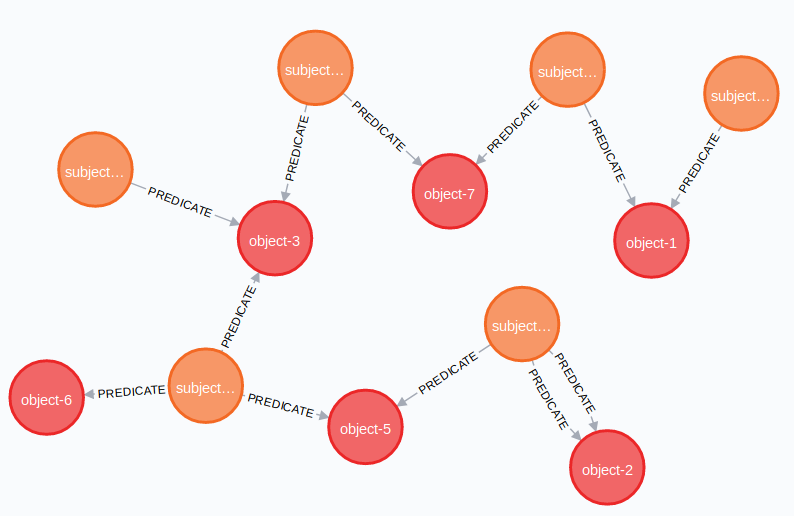
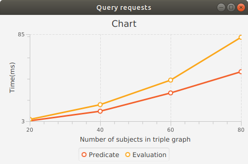
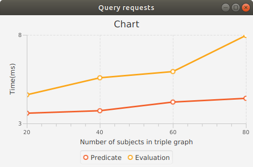
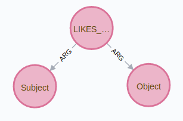
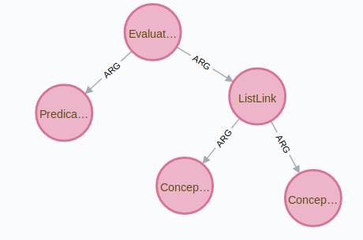
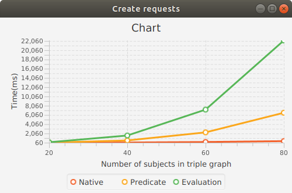
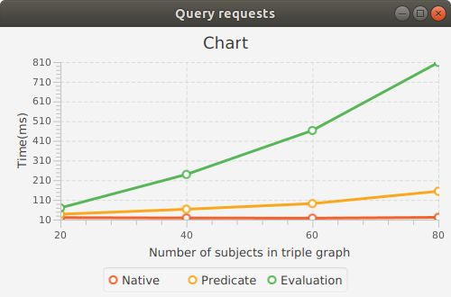
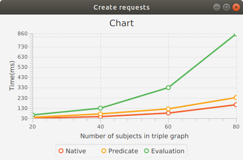
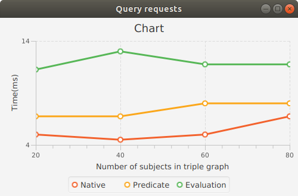

# AtomSpace backing storage performance

## Triple models and triple graph
The following 3 models are used to represent a triple (subject, predicate, object) in graph:
* Native Model
* Predicate Model
* Evaluation Model

Native model connects two nodes subject and object by predicate link: 
```cypher
(subject)-[predicate]->(object)
```
Predicate model stores subject and object nodes in a hyper-edge represented by predicate link:
```text
Predicate(Subject, Object)
```
Evaluation model stores triple in Evaluation hyper-edge in a way:
```text
Evaluation
    Predicate "predicate"
    List
        Subject "subject"
        Object  "object"
```

Triple graph with parameter N consists of a list of triples (subject, predicate, object)
where number of
```text
subjects: N  
objects: N  
predicates: N / 2  
predicates per subject: N / 4
```

Example of a triple graph with N = 8:  
```text
subjects: subject-0,...,subject-7  
objects: object-0,...,object-7  
predicates: predicate-0,...,predicate-3  
```
triples:
```text
(subject-4, predicate-0, object-4)
(subject-0, predicate-1, object-7)
...
(subject-6, predicate-3, object-7)
```
Triple graph with N = 8 in Native model:  



## Atomspace

### Predicate Model

Stores triple (subject, predicate, object) in a way that predicate becomes 'PredicateLink' link
with subject and object nodes.
For example triple (Alice, likes, ice-cream) is stored as:
```scheme
(LikesLink
  (Subject "Alice")
  (Object "ice-cream"))
```
query to object:
```scheme
(LikesLink
  (Subject "Alice")
  (Variable "$WHAT"))
```
### Evaluation Model

Stores triple (subject, predicate, object) in EvaluationLink like:
```scheme
(EvaluationLink
  (PredicateNode "likes")
    (ListLink
      (ConceptNode "Alice")
      (ConceptNode "ice-cream")))
```
query to object:
```scheme
(EvaluationLink
  (PredicateNode "likes")
    (ListLink
      (ConceptNode "Alice")
      (VariableNode "$WHAT")))
```
### Creation and query performance

Number in columns is the N parameter in the triple graph.

Create time (ms)

|Model     |  20   |  40   | 60    | 80     |
|----------|-------|-------|-------|--------|
|Predicate |3.40   |12.46  |29.70  |49.72   |
|Evaluation|4.73   |18.65  |41.79  |82.18   |



Query time (ms), number of queries is 50:

|Model     |  20   |  40   | 60    | 80     |
|----------|-------|-------|-------|--------|
|Predicate |3.58   |3.72   |4.21   |4.42    |
|Evaluation|4.62   |5.58   |5.93   |7.97    |



## Neo4j

### Native Model

Native model stores subject and object as nodes and predicate as link between them.  
For example triple (Alice, likes, ice-cream) is stored as:
```cypher
(:Subject {name: "Alice"}) - [:LIKES] -> (:Object {name: "ice-cream"})
```


Query to the object: What does Alice like?
```cypher
MATCH (Subject {name: "Alice"}) - [:LIKES] -> (obj:Object)
RETURN obj.name
```

### Predicate Model

Predicate model represents triple (subject, predicate, object) as
a hyper-edge 
```text
PredicateLink
    SubjectNode "subject"
    ObjectNode "object"
```
and is represented in property graph as   
Node:
```cypher
MERGE (:Atom:Node { id: {id}, type: {type}, value: {value}})  
```

Link:
```cypher
MATCH (a1:Atom {id: {id1}}), (a2:Atom {id: {id2}})
MERGE (a1)-[r:ARG {position: {position}}] ->(a2)
```



Query to the object: What does Alice like?
```cypher
MATCH
 (p:Atom:Link {type: "LIKES_LINK"})-[{position: 0}]-> (:Atom:Node {type: "Subject", value: "Alice"}),
 (p)-[{position: 1}]-> (o:Atom:Node {type: "Object"})
 RETURN o.value
```

### Evaluation Model

Evaluation model represents triple (subject, predicate, object) as
a hyper-edge 
```text
EvaluationLink
    PredicateNode "predicate"
    ListLink
        SubjectNode "subject"
        ObjectNode "object"
```



The code to create en evaluation link in Neo4j is the same as in the Predicate model.

Query to the object: What does Alice like?
```cypher
MATCH
(e:Atom:Link {type: 'EvaluationLink'}) - [:ARG {position: 0}] -> (:Atom:Node {value: {predicate}}),
(e) - [:ARG {position: 1}] -> (l:Atom:Link {type: 'ListLink'}),
(l) - [:ARG {position: 0}] -> (:Atom:Node {type: 'ConceptNode', value: {subject}}),
(l) - [:ARG {position: 1}] -> (o:Atom:Node {type: 'ConceptNode'})
RETURN o.value
```

### Creation and query performance using Cypher

Number in columns is the N parameter in the triple graph.

Create time (ms)

|Model     |  20   |  40   | 60    | 80     |
|----------|-------|-------|-------|--------|
|Native    |69.25  |106.00 |216.25 |399.75  |
|Predicate |82.00  |549.00 |2291.25|6539.75 |
|Evaluation|159.75 |1614.50|7217.75|22171.00|



Query time (ms), number of queries is 50:

|Model     |  20  |  40  | 60   | 80   |
|----------|------|------|------|------|
|Native    |20.25 |18.25 |17.25 |21.50 |
|Predicate |37.50 |62.75 |91.50 |154.00|
|Evaluation|69.75 |239.50|462.75|808.25|



### Creation and query performance using Java API

Number in columns is the N parameter in the triple graph.

Create time (ms)

|Model     |  20   |  40   | 60    | 80    |
|----------|-------|-------|-------|-------|
|Native    |31.00  |46.50  |81.25  |162.75 |
|Predicate |40.00  |73.00  |122.25 |233.25 |
|Evaluation|62.75  |128.75 |330.25 |856.75 |



Query time (ms), number of queries is 50:

|Model     |  20  |  40  | 60   | 80  |
|----------|------|------|------|-----|
|Native    |5.00  |4.50  |5.00  |6.75 |
|Predicate |6.75  |6.75  |8.00  |8.00 |
|Evaluation|11.25 |13.00 |11.75 |11.75|



## Storages

### Neo4j

* [Java API](https://neo4j.com/docs/api/java-driver/current)

Run docker:
```bash
docker run \
    --publish=7474:7474 --publish=7687:7687 \
    --volume=$HOME/neo4j/data:/data \
    --rm -d neo4j
```

Open Neo4j in browser: [http://localhost:7474/browser](http://localhost:7474/browser)

Commands:
```cypher
// get all nodes
MATCH (n) RETURN n;

// delete all nodes
MATCH (n) DELETE n;

// count nodes
MATCH (n) RETURN count(n);
```

Store triples (subject, predicate, object):
```cypher
MERGE (:Person {name: {subject}})
MERGE (:Item   {name: {object}})
MATCH (a:Person {name: {subject}}), (b:Item {name: {object}})
    CREATE (a)-[r:PREDICATE {name: {predicate}}] ->(b)
```

Query triples (subject, predicate, object):
```cypher
MATCH (:Person {name: {subject}})-[:PREDICATE {name: {predicate}}]->(s:Item) RETURN s.name
MATCH (o:Person)-[p:PREDICATE]->(s:Item) WHERE o.name = 'subject-0' and p.name = 'predicate-0'  RETURN s

```

## Data

### Ontology
* [Animal Natural History and Life History Ontology](http://aber-owl.net/ontology/ADW/)
* [Ontology Java parser OWLAPI](https://github.com/owlcs/owlapi/)
* [Introduction OWLAPI](http://syllabus.cs.manchester.ac.uk/pgt/2017/COMP62342/introduction-owl-api-msc.pdf)
