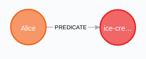
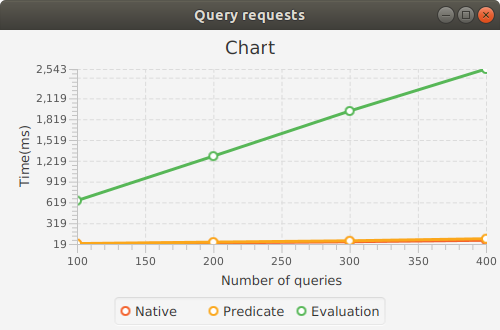

# AtomSpace backing storage performance

## Triple models and triple graph
The following 3 models are used to represent a triple (subject, predicate, object) in graph:
* Native Model
* Predicate Model
* Evaluation Model

Native model connects two nodes subject and object by predicate link: 
```cypher
(subject)-[predicate]->(object)
```
Predicate model stores subject and object nodes in a hyper-edge represented by predicate link:
```text
Predicate(Subject, Object)
```
Evaluation model stores triple in Evaluation hyper-edge in a way:
```text
Evaluation
    Predicate "predicate"
    List
        Subject "subject"
        Object  "object"
```

Triple graph with number of nodes N and number of triples S consists of a list of triples (subject, predicate, object)
where number of
```text
subjects: N  
objects: N  
predicates: N / 4
number of triples: S
```

Example of a triple graph with N = 8 and S = 4:
```text
subjects: subject-0,...,subject-7  
objects: object-0,...,object-7  
predicates: predicate-0,predicate-2
```
triples:
```text
(subject-4, predicate-0, object-4)
(subject-0, predicate-1, object-7)
(subject-3, predicate-1, object-5)
(subject-6, predicate-0, object-7)
```
Triple graph with N = 8 and S = 12 in Native model:


## Atomspace

### Predicate Model

Stores triple (subject, predicate, object) in a way that predicate becomes 'PredicateLink' link
with subject and object nodes.
For example triple (Alice, likes, ice-cream) is stored as:
```scheme
(LikesLink
  (Subject "Alice")
  (Object "ice-cream"))
```
query to object:
```scheme
(LikesLink
  (Subject "Alice")
  (Variable "$WHAT"))
```
### Evaluation Model

Stores triple (subject, predicate, object) in EvaluationLink like:
```scheme
(EvaluationLink
  (PredicateNode "likes")
    (ListLink
      (ConceptNode "Alice")
      (ConceptNode "ice-cream")))
```
query to object:
```scheme
(EvaluationLink
  (PredicateNode "likes")
    (ListLink
      (ConceptNode "Alice")
      (VariableNode "$WHAT")))
```
### Creation and query performance

Number in columns is the number of triples (parameter S in the triple graph).
Parameter N is 500 (number of subjects 500, objects 500, predicates 125).

Create time (ms)

|Model     |  100  |  200  | 300   | 400   |
|----------|-------|-------|-------|-------|
|Predicate |3.34   |7.87   |10.57  |14.36  |
|Evaluation|5.61   |10.19  |15.44  |18.73  |


Number in columns is the number of queries.
Parameter N is 500 (number of subjects 500, objects 500, predicates 125).
Parameter S is 500 (number of triples).

Query time (ms):

|Model     |1000  |2000  |3000 |4000 |
|----------|------|------|-----|-----|
|Predicate |74    |162   |240  |325  |
|Evaluation|105   |200   |331  |399  |


## Neo4j

### Native Model

Native model stores subject and object as nodes and predicate as link between them.  
For example triple (Alice, likes, ice-cream) is stored as:
```cypher
(:Subject {name: "Alice"}) - [:LIKES] -> (:Object {name: "ice-cream"})
```


Query to the object: What does Alice like?
```cypher
MATCH (Subject {name: "Alice"}) - [:LIKES] -> (obj:Object)
RETURN obj.name
```

### Predicate Model

Predicate model represents triple (subject, predicate, object) as
a hyper-edge 
```text
PredicateLink
    SubjectNode "subject"
    ObjectNode "object"
```
and is represented in property graph as   
Node:
```cypher
MERGE (:Atom:Node { id: {id}, type: {type}, value: {value}})  
```

Link:
```cypher
MATCH (a1:Atom {id: {id1}}), (a2:Atom {id: {id2}})
MERGE (a1)-[r:ARG {position: {position}}] ->(a2)
```


Query to the object: What does Alice like?
```cypher
MATCH
 (p:Atom:Link {type: "LIKES_LINK"})-[{position: 0}]-> (:Atom:Node {type: "Subject", value: "Alice"}),
 (p)-[{position: 1}]-> (o:Atom:Node {type: "Object"})
 RETURN o.value
```

### Evaluation Model

Evaluation model represents triple (subject, predicate, object) as
a hyper-edge 
```text
EvaluationLink
    PredicateNode "predicate"
    ListLink
        SubjectNode "subject"
        ObjectNode "object"
```


The code to create en evaluation link in Neo4j is the same as in the Predicate model.

Query to the object: What does Alice like?
```cypher
MATCH
(e:Atom:Link {type: 'EvaluationLink'}) - [:ARG {position: 0}] -> (:Atom:Node {value: {predicate}}),
(e) - [:ARG {position: 1}] -> (l:Atom:Link {type: 'ListLink'}),
(l) - [:ARG {position: 0}] -> (:Atom:Node {type: 'ConceptNode', value: {subject}}),
(l) - [:ARG {position: 1}] -> (o:Atom:Node {type: 'ConceptNode'})
RETURN o.value
```

### Creation and query performance using Cypher

The following indices are used in Neo4j:
```cypher
CREATE INDEX ON :Atom(id)
CREATE INDEX ON :Atom(type)
CREATE INDEX ON :ARG(position)
CREATE INDEX ON :Subject(value)
CREATE INDEX ON :Object(value)
```

Number in columns is the number of triples (parameter S in the triple graph).
Parameter N is 500 (number of subjects 500, objects 500, predicates 125).

Create time (ms)

|Model     |  100  |  200  | 300   | 400   |
|----------|-------|-------|-------|-------|
|Native    |18     |31     |37     |42     |
|Predicate |24     |48     |66     |84     |
|Evaluation|42     |76     |112    |138    |


Number in columns is the number of queries.
Parameter N is 500 (number of subjects 500, objects 500, predicates 125).
Parameter S is 500 (number of triples).

Query time (ms):

|Model     |100   |200   |300  |400 |
|----------|------|------|-----|----|
|Native    |19    |35    |52   |73  |
|Predicate |25    |46    |65   |95  |
|Evaluation|645   |1286  |1937 |2543|




### Creation and query performance using Java API

Number in columns is the number of triples (parameter S in the triple graph).
Parameter N is 500 (number of subjects 500, objects 500, predicates 125).

Create time (ms)

|Model     |  100  |  200  | 300   | 400   |
|----------|-------|-------|-------|-------|
|Native    |12     |20     |37     |49     |
|Predicate |15     |32     |50     |60     |
|Evaluation|25     |53     |93     |128    |


Number in columns is the number of queries.
Parameter N is 500 (number of subjects 500, objects 500, predicates 125).
Parameter S is 500 (number of triples).

Query time (ms):

|Model     |1000  |2000  |3000 |4000 |
|----------|------|------|-----|-----|
|Native    |57    |130   |187  |256  |
|Predicate |64    |142   |213  |269  |
|Evaluation|69    |151   |219  |287  |


## Conclusion

Atomspace shows linear dependency for atoms creation and query execution in Predicate and Evaluation
models.

Cypher QL for Neo4j heavily relates on created indices which can improve creation and query execution time.
Creation time is linearly dependent on the number of chosen statements for all models with the given indices.
Query time for evaluation model shows degradation over number of queries.
It should be mention that may be it is possible to choose another indices that can improve the query results.


Java API for Neo4j shows linear dependency both for creation and query execution time for all models.
It is because Java API allows to reuse created nodes and link for parent link creation instead of querying
them again as in the case of Cypher QL.